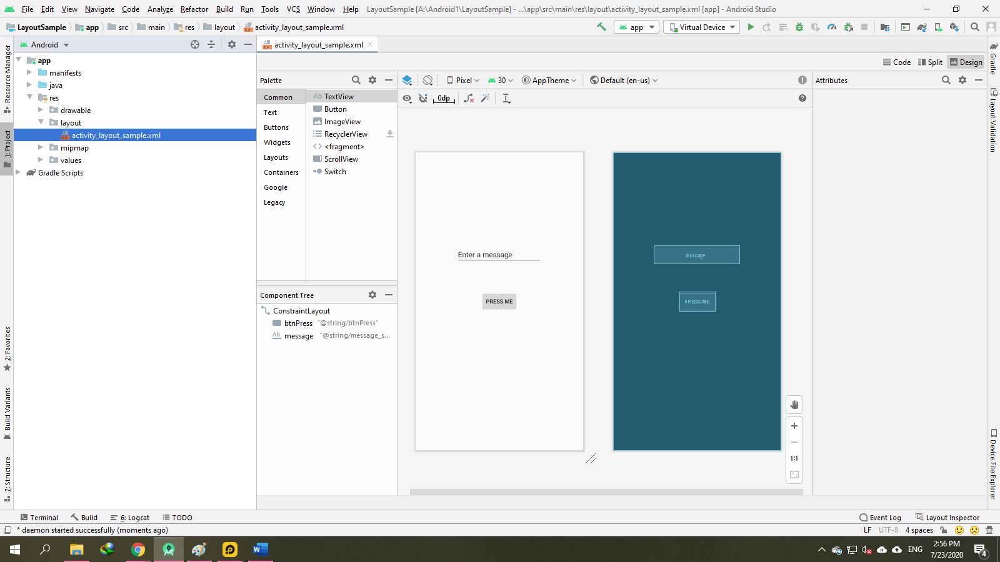

### Thiết kế giao diện người dùng với công cụ thiết kế Android Studio 4.X

- <a href= "https://ngocminhtran.com/2018/08/12/thiet-ke-giao-dien-nguoi-dung-voi-cong-cu-thiet-ke-android-studio-3-x/"> Ứng Dụng Từ Bài</a>

### Yêu Cầu

- Thiết kế cho các thiết bị khác nhau
- Giao diện người dùng (user interfaces – UI) của các ứng dụng Android phải được thiết kế sao cho tương thích với với các thiết bị di động như điện thoại thông minh hay máy tính bảng có kích thước khác nhau. Ngoài ra, mỗi thiết bị lại có hai chế độ xem là portrait (hướng dọc) và landscape (hướng ngang) nên giao diện ứng dụng cũng cần thay đổi một cách tương ứng với mỗi chế độ.

- Views và views group
-Một giao diện người dùng của ứng dụng Android được tạo thành bởi nhiều phần tử khác nhau. Mỗi phần tử trên giao diện là một lớp con của lớp View (android.view.View). Các views trong Android còn được gọi là các widgets hay components. Android SDK cung cấp nhiều views được xây dựng sẵn hỗ trợ cho việc thiết kế giao diện như Button, CheckBox, TextView, v.v.

- Mỗi view có thể chứa nhiều views khác, lúc này chúng ta gọi là view group. Mỗi view group là lớp con của lớp ViewGroup (android.view.ViewGroup) và ViewGroup lại là lớp con của lớp View. Một ví dụ về ViewGroup có sẵn là RadioGroup chứa các RadioButton.

- Một dạng khác của ViewGroup là layout manager (trình quản lý layout).

- Layout managers
- Một layout là một dạng của ViewGroup nên cũng là lớp con của lớp ViewGroup. Nhiệm vụ của layout là kiểm soát cách thức các thành phần hay views được định vị trong giao diện màn hình.

- Android SDK cung cấp một số layouts hỗ trợ cho việc thiết kế giao diện gồm:

-ConstraintLayout (hỗ trợ từ Android Studio 3.0 hay Android 8)
-LinearLayout
-TableLayout
-FrameLayout
-GridLayout
-RelativeLayout
-AssoluteLayout
-CoordinatorLayout
-Một số layout không được khuyên dùng như AbsoluteLayout vì tính “cứng nhắc” của nó hay một số layout đã lỗi thời như CoordinatorLayout. Các layout sẽ được đề cập kĩ hơn trong các bài viết sau này.

 ### Thiết kế giao diện người dùng
 ### Tạo dự án mới
 
 - <a href="https://github.com/ChanhMinions/DaoQuanhUngDungAndroid">Có Thể Xem Lại Bài Trước</a>
 
 - Sau Khi chúng Ta tạo Xong như Bài Trước chúng ta làm tương tự với bài này
  
 
 
 - Layout Inspector
 - Android Studio 3.X cung cấp một cung cụ tiện ích là Layout Inspector giúp chúng ta kiểm soát, so sánh các layouts tốt hơn. Để dùng Layout Inspector chúng ta cần:

- Mở ứng dụng từ máy ảo Android hay Genymotion
- Vào Tools > Layout Inspector
- Chọn ứng dụng từ hộp thoại Choose Process

 - Khung ViewTree sẽ xuất hiện cho phép chúng ta xem các thành phần giao diện trong khi ứng dụng đang chạy
 - Như Trên Hình
 
 ### Chúc Các Bạn Thành Công !!!

### Bạn Có Thể Xem Bài Tiếp Theo:

- <a href="https://github.com/ChanhMinions/TESTVIEW">Các views cơ bản và trong giao diện ứng dụng Android!</a>

                                                                                  Trần Phú , Ngày 23 tháng 7 Năm 2020
